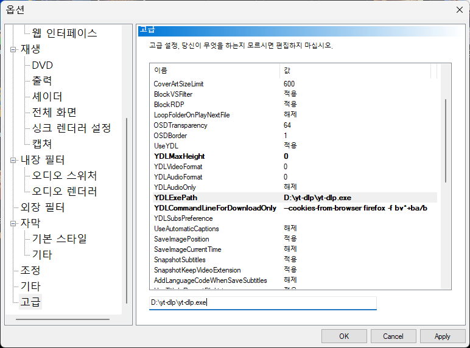

# 미디어플레이어 클래식에서 yt-dlp 사용

> 미디어 플레이어 클래식 (Fork: https://github.com/clsid2/mpc-hc ) 와 yt-dlp를 활용하면 유튜브 동영상을 쉽게 받을 수 있다.
> 
> mpc-hc에서 파일/URL 열기로 Youtube 주소를 넣어서 영상을 열은 다음, 
> 다른이름으로 저장하기를 하면 yt-dlp가 실행되면서 영상을 다운로드한다.




### 추천 옵션

> 최고 화질로 다운로드 하도록 설정

* YDLMaxHeight (세로 해상도 기본 값은 1440인데, 가능한 최대 해상도를 가져오도록 0으로 변경)

  ```
  0
  ```

* YDLExePath (yt-dlp.exe의 위치)

  ```
  D:\yt-dlp\yt-dlp.exe
  ```

* YDLCommandLineForDownloadOnly (firefox 로그인쿠키 사용 + 최고화질 + 최고 음질)

  ```
  --cookies-from-browser firefox -f bv*+ba/b
  ```

  * Youtube 로그인이 되야지만 접근이 가능한 영상의 경우. 로그인 쿠키를 사용할 수 있는 옵션이 필요한데, 위의 예라면 Firefox에서 Youtube 로그인 상태로 두고 mpc-hc에서 URL로 동영상을 열면 firefox의 로그인 쿠키를 사용해서 동영상을 재생하고, 저장할 수 있다.


### 기타 사항

* Youtube 동영상 다운로드를 위한 yt-dlp(yt-dlp-ejs)는 nodejs보다 https://deno.com/ 를 설치해야 좀 더 매끄럽게 동작한다.  

  

